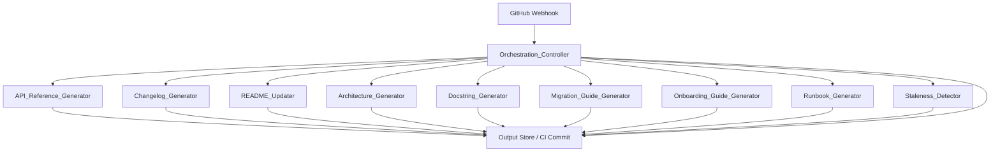
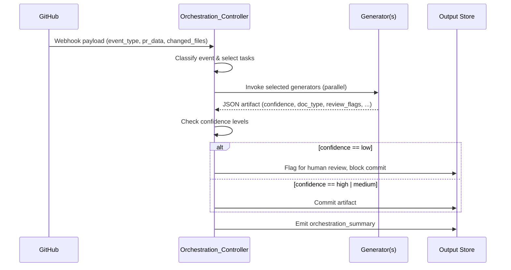

# Design Document: DocuBot

## Overview

DocuBot is an autonomous documentation orchestration system that acts as a senior technical writer and software engineer agent. It integrates into CI/CD pipelines via GitHub webhooks, analyzes source code and pull request data, and produces structured JSON documentation artifacts. All content is derived strictly from code and PR data — DocuBot never invents or assumes behavior, and flags ambiguous items with `⚠️` review markers for human review.

The system is composed of ten specialized generator components and one orchestration controller. Each component is independently invocable and produces a self-describing JSON output that conforms to a shared output contract (required fields: `confidence`, `doc_type`, `review_flags`).

### Design Goals

- **Correctness over completeness**: DocuBot prefers flagging uncertainty over generating plausible-but-wrong documentation.
- **Composability**: Each generator is a stateless function that can be invoked independently or as part of an orchestrated pipeline.
- **Traceability**: Every output artifact references the source inputs (PR number, file paths, commit SHA) that produced it.
- **Pipeline-native**: Outputs are structured JSON so downstream CI/CD tooling can parse, route, and act on them without human intervention.

---

## Architecture

### High-Level Architecture



### Event-Driven Dispatch

The Orchestration_Controller is the single entry point for all GitHub events. It receives a webhook payload, classifies the event type, inspects the changed file list, and dispatches to the relevant generator components. Each generator runs independently and returns a JSON artifact. The controller collects all results and emits an `orchestration_summary` artifact.



### Event-to-Task Dispatch Table

| Event Type       | Tasks Invoked                                                                 |
|------------------|-------------------------------------------------------------------------------|
| `pr_merged`      | Changelog_Generator, README_Updater, Migration_Guide_Generator (if breaking) |
| `push_to_main`   | Staleness_Detector                                                            |
| `scheduled`      | Architecture_Generator, Staleness_Detector                                   |
| `manual_trigger` | Specified task only                                                           |

---

## Components and Interfaces

All components share the same invocation contract: they accept a typed `Input` object and return a typed `Output` object that always includes the three required fields.

### Shared Output Contract

Every generator output MUST include:

```typescript
interface BaseOutput {
  doc_type: string;           // identifies the artifact category
  confidence: "high" | "medium" | "low";
  review_flags: string[];     // entries prefixed with "⚠️"; empty array if none
  source_ref: SourceRef;      // traceability back to inputs
}

interface SourceRef {
  commit_sha?: string;
  pr_number?: number;
  file_paths?: string[];
  generated_at: string;       // ISO 8601 timestamp
}
```

### 1. Orchestration_Controller

**Responsibility**: Receive GitHub webhook events, classify them, dispatch to generators, collect results, enforce the low-confidence review gate, and emit an orchestration summary.

**Input**:
```typescript
interface OrchestratorInput {
  event_type: "pr_merged" | "push_to_main" | "scheduled" | "manual_trigger";
  pr_data?: PullRequestData;
  changed_files: string[];
  task_name?: string;         // only for manual_trigger
  repo_context: RepoContext;
}
```

**Output**:
```typescript
interface OrchestratorOutput extends BaseOutput {
  doc_type: "orchestration_summary";
  tasks: TaskResult[];
}

interface TaskResult {
  task_name: string;
  status: "success" | "flagged_for_review" | "blocked" | "not_applicable";
  confidence: "high" | "medium" | "low";
  artifact_path?: string;
}
```

### 2. API_Reference_Generator

**Responsibility**: Parse source code files and produce structured API reference documentation for all exported symbols.

**Input**:
```typescript
interface ApiRefInput {
  source_files: SourceFile[];
  language: SupportedLanguage;
}
```

**Output**:
```typescript
interface ApiRefOutput extends BaseOutput {
  doc_type: "api_reference";
  symbols: ApiSymbol[];
}

interface ApiSymbol {
  name: string;
  kind: "function" | "class" | "type" | "constant" | "route";
  signature: string;
  description: string;
  parameters: Parameter[];
  returns: ReturnValue;
  throws: ErrorCondition[];
  side_effects?: string;
  notes?: string;
  examples: CodeExample[];
  confidence: "high" | "medium" | "low";
  review_flags: string[];
}
```

### 3. Changelog_Generator

**Responsibility**: Analyze merged PR data and produce a structured changelog entry with semantic version classification.

**Input**:
```typescript
interface ChangelogInput {
  pr_title: string;
  pr_description: string;
  pr_diff: string;
  pr_number: number;
}
```

**Output**:
```typescript
interface ChangelogOutput extends BaseOutput {
  doc_type: "changelog_entry";
  summary: string;
  version_bump: "major" | "minor" | "patch";
  breaking_changes?: BreakingChange[];
  migration_notes?: string;
}

interface BreakingChange {
  symbol: string;
  description: string;
}
```

### 4. README_Updater

**Responsibility**: Determine whether a merged PR requires README changes and, if so, produce the complete updated README content.

**Input**:
```typescript
interface ReadmeInput {
  pr_title: string;
  pr_description: string;
  pr_diff: string;
  current_readme: string;
}
```

**Output**:
```typescript
interface ReadmeOutput extends BaseOutput {
  doc_type: "readme_update";
  update_required: boolean;
  updated_content?: string;   // present only when update_required is true
}
```

### 5. Architecture_Generator

**Responsibility**: Analyze an entire codebase and produce a comprehensive architecture overview.

**Input**:
```typescript
interface ArchitectureInput {
  repo_context: RepoContext;
  file_tree: FileTreeNode[];
  source_files: SourceFile[];
}
```

**Output**:
```typescript
interface ArchitectureOutput extends BaseOutput {
  doc_type: "architecture_overview";
  directory_summary: ModuleSummary[];
  critical_path: CriticalPathStep[];
  data_flow: DataFlowEdge[];
  external_services: ExternalService[];
  key_files: KeyFile[];
  gotchas: string[];
}
```

### 6. Docstring_Generator

**Responsibility**: Identify undocumented or poorly documented functions in a source file and generate language-appropriate documentation comments.

**Input**:
```typescript
interface DocstringInput {
  source_file: SourceFile;
  language: SupportedLanguage;
}
```

**Output**:
```typescript
interface DocstringOutput extends BaseOutput {
  doc_type: "docstring_additions";
  modified_file_content: string;
  additions: DocstringAddition[];
}

interface DocstringAddition {
  function_name: string;
  line_number: number;
  generated_comment: string;
  confidence: "high" | "medium" | "low";
  review_flags: string[];
}
```

### 7. Migration_Guide_Generator

**Responsibility**: Produce a step-by-step migration guide when a PR introduces breaking changes.

**Input**:
```typescript
interface MigrationInput {
  pr_diff: string;
  breaking_changes: BreakingChange[];
  pr_number: number;
}
```

**Output**:
```typescript
interface MigrationOutput extends BaseOutput {
  doc_type: "migration_guide";
  applicable: boolean;
  steps?: MigrationStep[];
  effort_estimate?: "low" | "medium" | "high";
  rollback_instructions?: string;
}

interface MigrationStep {
  step_number: number;
  description: string;
  before_example: string;
  after_example: string;
}
```

### 8. Onboarding_Guide_Generator

**Responsibility**: Produce a complete Getting Started guide derived from project configuration files.

**Input**:
```typescript
interface OnboardingInput {
  repo_context: RepoContext;
  config_files: ConfigFile[];
}
```

**Output**:
```typescript
interface OnboardingOutput extends BaseOutput {
  doc_type: "onboarding_guide";
  prerequisites: Prerequisite[];
  setup_steps: SetupStep[];
  environment_variables: EnvVar[];
  external_dependencies: string[];
  startup_commands: string[];
  verification_steps: string[];
  test_commands: string[];
  common_mistakes: CommonMistake[];
}
```

### 9. Runbook_Generator

**Responsibility**: Produce an operations runbook from codebase and deployment configuration.

**Input**:
```typescript
interface RunbookInput {
  repo_context: RepoContext;
  deployment_config: DeploymentConfig;
  source_files: SourceFile[];
}
```

**Output**:
```typescript
interface RunbookOutput extends BaseOutput {
  doc_type: "ops_runbook";
  deployment_procedures: DeploymentProcedure[];
  monitoring_setup: MonitoringConfig;
  alert_definitions: AlertDefinition[];
  operational_tasks: OperationalTask[];
  failure_modes: FailureMode[];
}
```

### 10. Staleness_Detector

**Responsibility**: Compare existing documentation against the current codebase and report all discrepancies with severity classifications.

**Input**:
```typescript
interface StalenessInput {
  existing_docs: DocumentationFile[];
  source_files: SourceFile[];
  repo_context: RepoContext;
}
```

**Output**:
```typescript
interface StalenessOutput extends BaseOutput {
  doc_type: "staleness_report";
  findings: StalenessFinding[];
  summary: StalenessSummary;
}

interface StalenessFinding {
  severity: "critical" | "warning" | "info";
  doc_location: DocLocation;
  description: string;
  suggested_correction: string;
}

interface DocLocation {
  file: string;
  section: string;
}

interface StalenessSummary {
  critical_count: number;
  warning_count: number;
  info_count: number;
}
```

---

## Data Models

### Shared / Primitive Types

```typescript
type SupportedLanguage =
  | "javascript"
  | "typescript"
  | "python"
  | "java"
  | "kotlin"
  | "go"
  | "ruby"
  | "rust";

interface SourceFile {
  path: string;
  content: string;
  language: SupportedLanguage;
}

interface RepoContext {
  repo_name: string;
  default_branch: string;
  commit_sha: string;
  languages: SupportedLanguage[];
}

interface PullRequestData {
  pr_number: number;
  title: string;
  description: string;
  diff: string;
  merged_at: string;       // ISO 8601
  author: string;
  labels: string[];
}

interface Parameter {
  name: string;
  type: string;
  description: string;
  required: boolean;
  default_value?: string;
}

interface ReturnValue {
  type: string;
  description: string;
}

interface ErrorCondition {
  error_type: string;
  condition: string;
}

interface CodeExample {
  language: SupportedLanguage;
  code: string;
  description?: string;
}

interface FileTreeNode {
  path: string;
  kind: "file" | "directory";
  children?: FileTreeNode[];
}

interface ModuleSummary {
  path: string;
  responsibility: string;
}

interface CriticalPathStep {
  component: string;
  action: string;
  output: string;
}

interface DataFlowEdge {
  from: string;
  to: string;
  data_description: string;
}

interface ExternalService {
  name: string;
  role: string;
  protocol?: string;
}

interface KeyFile {
  path: string;
  rationale: string;
}

interface ConfigFile {
  path: string;
  content: string;
}

interface DeploymentConfig {
  files: ConfigFile[];
}

interface DocumentationFile {
  path: string;
  content: string;
}

interface Prerequisite {
  tool: string;
  version: string;
  install_url?: string;
}

interface SetupStep {
  step_number: number;
  description: string;
  command?: string;
}

interface EnvVar {
  name: string;
  purpose: string;
  example_value: string;
  required: boolean;
}

interface CommonMistake {
  mistake: string;
  resolution: string;
}

interface DeploymentProcedure {
  name: string;
  pre_checks: string[];
  commands: string[];
  post_verification: string[];
}

interface MonitoringConfig {
  dashboards: string[];
  log_locations: string[];
}

interface AlertDefinition {
  name: string;
  condition: string;
  severity: string;
  response: string;
}

interface OperationalTask {
  name: string;
  steps: string[];
}

interface FailureMode {
  name: string;
  symptoms: string[];
  probable_causes: string[];
  remediation_steps: string[];
}
```

### Confidence and Review Flag Rules

The following rules govern `confidence` and `review_flags` assignment across all components:

| Condition | confidence | review_flags |
|-----------|-----------|--------------|
| All inputs are present and unambiguous | `high` | `[]` |
| Inputs are present but partially ambiguous | `medium` | One or more `⚠️` entries |
| Inputs are missing, contradictory, or behavior cannot be determined | `low` | One or more `⚠️` entries (required) |

**Invariant**: A `confidence` of `low` MUST always be accompanied by at least one entry in `review_flags`. A non-empty `review_flags` array MUST always be accompanied by `confidence` of `medium` or `low`.


---

## Correctness Properties

*A property is a characteristic or behavior that should hold true across all valid executions of a system — essentially, a formal statement about what the system should do. Properties serve as the bridge between human-readable specifications and machine-verifiable correctness guarantees.*

### Property 1: Output Contract Invariant

*For any* generator invocation with any valid input, the output SHALL be a syntactically valid JSON object containing exactly the fields `confidence` (one of `"high"`, `"medium"`, `"low"`), `doc_type` (a non-empty string), and `review_flags` (an array).

**Validates: Requirements 1.1, 1.2, 1.3**

---

### Property 2: Confidence / Review Flags Co-occurrence Invariant

*For any* generator output, `confidence === "low"` SHALL imply `review_flags.length > 0`, and `review_flags.length > 0` SHALL imply `confidence` is `"medium"` or `"low"`. These two conditions are always paired — neither can hold without the other.

**Validates: Requirements 1.4, 2.6, 3.6, 4.6, 6.8, 8.5, 9.5**

---

### Property 3: API Symbol Detection Completeness

*For any* source file containing N exported symbols (functions, classes, routes, types, constants), the API_Reference_Generator output SHALL contain exactly N entries in the `symbols` array — no exported symbol is omitted and no non-exported symbol is included.

**Validates: Requirements 2.1**

---

### Property 4: API Symbol Documentation Completeness

*For any* exported function or method detected by the API_Reference_Generator, the corresponding `ApiSymbol` entry SHALL have non-empty `name`, `signature`, `parameters`, `returns`, and `examples` fields, and SHALL include `side_effects` when the function has observable side effects and `notes` when the function has associated caveats.

**Validates: Requirements 2.2, 2.3, 2.4, 2.5**

---

### Property 5: Breaking Change Triggers Major Version and Completeness

*For any* merged PR that contains at least one Breaking_Change, the Changelog_Generator output SHALL have `version_bump === "major"`, a non-empty `breaking_changes` array, and a non-empty `migration_notes` field — all three conditions hold simultaneously and unconditionally regardless of confidence level.

**Validates: Requirements 3.3, 3.4**

---

### Property 6: Semantic Version Bump Validity

*For any* merged PR input, the Changelog_Generator output SHALL have `version_bump` set to exactly one of `"major"`, `"minor"`, or `"patch"` — no other value is permitted.

**Validates: Requirements 3.2**

---

### Property 7: README Update-Required Consistency

*For any* merged PR input, the README_Updater output SHALL satisfy: if `update_required === true` then `updated_content` is a non-empty string, and if `update_required === false` then `updated_content` is absent from the output. These two conditions are mutually exclusive and exhaustive.

**Validates: Requirements 4.2, 4.3**

---

### Property 8: README Section Preservation

*For any* README with N distinct sections and a PR that only affects a strict subset of those sections, the README_Updater output's `updated_content` SHALL contain all N sections, with the unaffected sections byte-for-byte identical to the original.

**Validates: Requirements 4.4**

---

### Property 9: Docstring Targets Only Undocumented Functions

*For any* source file containing M adequately documented functions and N undocumented or poorly documented functions, the Docstring_Generator output SHALL contain exactly N entries in the `additions` array — no adequately documented function SHALL appear in `additions`.

**Validates: Requirements 6.1**

---

### Property 10: Docstring Language Format Correctness

*For any* source file in a supported language, every generated documentation comment in the Docstring_Generator output SHALL use the format prescribed for that language: JSDoc for JavaScript/TypeScript, Google-style docstrings for Python, Javadoc for Java/Kotlin, GoDoc for Go, YARD for Ruby, and doc comments for Rust.

**Validates: Requirements 6.2**

---

### Property 11: Docstring Parameter and Return Completeness

*For any* function with P parameters and a return value, the generated documentation comment SHALL contain exactly P parameter entries (each with name, type, and description) and one return value entry (with type and description). Functions that raise or throw errors SHALL additionally have those error conditions documented.

**Validates: Requirements 6.3, 6.4, 6.5**

---

### Property 12: Migration Guide Completeness When Breaking Changes Present

*For any* PR diff containing at least one Breaking_Change, the Migration_Guide_Generator output SHALL have `applicable === true`, a non-empty `steps` array where every step has non-empty `before_example` and `after_example`, an `effort_estimate` of exactly `"low"`, `"medium"`, or `"high"`, and a non-empty `rollback_instructions` field.

**Validates: Requirements 7.1, 7.2, 7.3, 7.4**

---

### Property 13: Migration Guide Not Applicable Without Breaking Changes

*For any* PR diff that contains no Breaking_Changes, the Migration_Guide_Generator output SHALL have `applicable === false` and SHALL omit `steps`, `effort_estimate`, and `rollback_instructions`.

**Validates: Requirements 7.6**

---

### Property 14: Onboarding Commands Derived From Config Files

*For any* codebase with a `package.json`, `Makefile`, or `docker-compose.yml`, the Onboarding_Guide_Generator output's `startup_commands` and `test_commands` SHALL be a subset of the commands defined in those files — no command SHALL appear in the output that is not present in the actual project configuration files.

**Validates: Requirements 8.2**

---

### Property 15: Onboarding Environment Variable Completeness

*For any* `.env.example` file containing N environment variable definitions, the Onboarding_Guide_Generator output SHALL contain exactly N entries in `environment_variables`, each with non-empty `name`, `purpose`, and `example_value` fields.

**Validates: Requirements 8.3**

---

### Property 16: Staleness Finding Completeness

*For any* pair of (documentation, codebase) where the documentation contains N references to symbols that no longer exist in the codebase, the Staleness_Detector output SHALL contain at least N findings covering those stale references.

**Validates: Requirements 10.1**

---

### Property 17: Staleness Severity Classification Validity

*For any* Staleness_Detector output, every entry in the `findings` array SHALL have `severity` set to exactly one of `"critical"`, `"warning"`, or `"info"`, and every finding SHALL have non-empty `doc_location`, `description`, and `suggested_correction` fields.

**Validates: Requirements 10.2, 10.3**

---

### Property 18: Non-Existent Symbol Reference → Critical Severity

*For any* documentation that references a symbol not present in the current codebase, the Staleness_Detector SHALL classify the corresponding finding with `severity === "critical"`.

**Validates: Requirements 10.4**

---

### Property 19: Undocumented Exported Symbol → Warning Severity

*For any* codebase containing N exported symbols that have no corresponding documentation entry, the Staleness_Detector output SHALL contain N findings with `severity === "warning"`, one per undocumented symbol.

**Validates: Requirements 10.5**

---

### Property 20: Event Dispatch Correctness

*For any* GitHub event received by the Orchestration_Controller, the set of tasks invoked SHALL match the dispatch table exactly:
- `pr_merged` → always invokes Changelog_Generator and README_Updater; invokes Migration_Guide_Generator if and only if breaking changes are detected
- `push_to_main` → always invokes Staleness_Detector and only Staleness_Detector
- `scheduled` → always invokes Architecture_Generator and Staleness_Detector and only those two
- `manual_trigger` with `task_name=T` → invokes exactly one task T and no others

**Validates: Requirements 11.1, 11.2, 11.3, 11.4**

---

### Property 21: Changed Files Scope Limiting

*For any* event with a `changed_files` list that only contains files relevant to a strict subset of components, the Orchestration_Controller SHALL not invoke components for which none of the changed files are relevant.

**Validates: Requirements 11.5**

---

### Property 22: Low-Confidence Output Blocked From Commit

*For any* generator invocation that returns `confidence === "low"`, the Orchestration_Controller SHALL record the corresponding task result with `status === "flagged_for_review"` or `status === "blocked"` in the orchestration summary, and SHALL NOT allow the artifact to be committed to the repository.

**Validates: Requirements 11.6**

---

## Error Handling

### Input Validation Errors

Each generator validates its input before processing. Invalid inputs produce an output with `confidence: "low"` and a descriptive `review_flags` entry rather than throwing an unhandled exception.

| Error Condition | Behavior |
|----------------|----------|
| Required input field missing | Return output with `confidence: "low"`, `review_flags: ["⚠️ Missing required input: <field_name>"]` |
| Source file unparseable | Return output with `confidence: "low"`, `review_flags: ["⚠️ Could not parse source file: <path>"]` |
| Unsupported language | Return output with `confidence: "low"`, `review_flags: ["⚠️ Unsupported language: <lang>"]` |
| Empty PR diff | Return output with `confidence: "low"`, `review_flags: ["⚠️ PR diff is empty — cannot determine changes"]` |
| Config files absent | Return output with `confidence: "low"`, `review_flags: ["⚠️ Missing config file: <path>"]` |

### Orchestration Errors

| Error Condition | Behavior |
|----------------|----------|
| Generator returns `confidence: "low"` | Flag artifact for human review; block commit; record `status: "flagged_for_review"` in summary |
| Flagging mechanism itself fails | Block commit entirely; surface error; record `status: "blocked"` in summary |
| Unknown event type | Log error; return orchestration summary with `status: "blocked"` and a `review_flags` entry |
| Unknown `task_name` in `manual_trigger` | Return orchestration summary with `status: "blocked"` and `review_flags: ["⚠️ Unknown task: <task_name>"]` |
| Generator throws unexpected exception | Catch exception; record `status: "blocked"`; include exception message in `review_flags` |

### Content Derivation Errors

When a generator cannot derive content from the provided inputs (e.g., a function body is too short to infer behavior), it MUST:
1. Set `confidence` to `"low"` for the affected symbol/section
2. Add a `⚠️`-prefixed entry to `review_flags` describing what could not be determined
3. Omit the undeterminable field rather than populating it with a placeholder

DocuBot MUST NOT populate any documentation field with invented, assumed, or hallucinated content.

---

## Testing Strategy

### Dual Testing Approach

DocuBot's testing strategy combines example-based unit tests for specific behaviors with property-based tests for universal correctness guarantees.

**Unit tests** cover:
- Specific `doc_type` constant assertions for each generator
- Known PR/codebase fixtures with expected outputs
- Error handling paths (missing inputs, unsupported languages, empty diffs)
- Integration between Orchestration_Controller and generators

**Property-based tests** cover:
- All 22 correctness properties defined above
- Each property test runs a minimum of **100 iterations** with randomly generated inputs
- Generators are tested with mocked I/O to keep tests fast and deterministic

### Property-Based Testing Library

The recommended PBT library depends on the implementation language:

| Language | Library |
|----------|---------|
| TypeScript / JavaScript | [fast-check](https://github.com/dubzzz/fast-check) |
| Python | [Hypothesis](https://hypothesis.readthedocs.io/) |
| Java / Kotlin | [jqwik](https://jqwik.net/) |
| Go | [gopter](https://github.com/leanovate/gopter) |
| Rust | [proptest](https://github.com/proptest-rs/proptest) |

### Property Test Configuration

Each property test MUST:
- Run a minimum of **100 iterations**
- Include a comment tag referencing the design property:
  ```
  // Feature: docubot, Property N: <property_text>
  ```
- Use a dedicated generator (arbitrary) for each input type
- Be implemented as a single property-based test per correctness property

### Generator Arbitraries

The following input generators are needed for property tests:

| Arbitrary | Description |
|-----------|-------------|
| `arbSourceFile` | Random source file with N exported symbols in a random supported language |
| `arbPullRequest` | Random PR with title, description, diff, and optional breaking changes |
| `arbReadme` | Random README with N distinct sections |
| `arbCodebase` | Random codebase with M top-level modules and optional config files |
| `arbDeploymentConfig` | Random deployment config with K procedures and L failure modes |
| `arbDocumentationFile` | Random documentation file with references to symbols (some stale) |
| `arbGitHubEvent` | Random GitHub event of any valid event type |
| `arbBreakingChange` | Random breaking change with symbol name and description |

### Unit Test Coverage Targets

| Component | Unit Tests | Property Tests |
|-----------|-----------|----------------|
| Orchestration_Controller | Event routing, error handling, summary format | Properties 20, 21, 22 |
| API_Reference_Generator | Known symbol fixtures, edge cases | Properties 1, 2, 3, 4 |
| Changelog_Generator | Known PR fixtures, version bump logic | Properties 1, 2, 5, 6 |
| README_Updater | Known PR/README fixtures | Properties 1, 2, 7, 8 |
| Architecture_Generator | Known codebase fixtures | Properties 1, 2 |
| Docstring_Generator | Known function fixtures per language | Properties 1, 2, 9, 10, 11 |
| Migration_Guide_Generator | Known breaking change fixtures | Properties 1, 2, 12, 13 |
| Onboarding_Guide_Generator | Known config file fixtures | Properties 1, 2, 14, 15 |
| Runbook_Generator | Known deployment config fixtures | Properties 1, 2 |
| Staleness_Detector | Known doc/codebase pairs | Properties 1, 2, 16, 17, 18, 19 |

### Integration Tests

Integration tests verify the end-to-end pipeline with real GitHub webhook payloads (replayed from fixtures):

1. `pr_merged` with breaking changes → verify all three generators are invoked and outputs are committed
2. `pr_merged` without breaking changes → verify Migration_Guide_Generator is not invoked
3. `push_to_main` → verify Staleness_Detector is invoked
4. `scheduled` → verify Architecture_Generator and Staleness_Detector are invoked
5. `manual_trigger` → verify only the specified task is invoked
6. Generator returns `confidence: "low"` → verify commit is blocked and summary shows `flagged_for_review`
